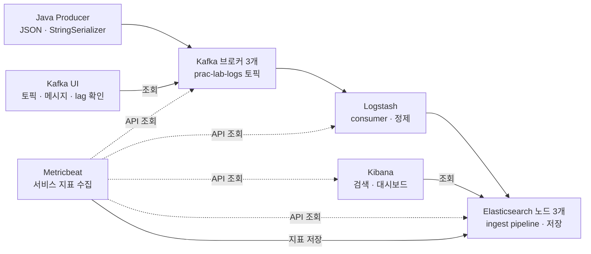

# Kafka → Logstash → Elasticsearch → Kibana 로그 파이프라인

테스트 로그를 생성해 Kafka로 보내고, Logstash가 소비·정제한 뒤 Elasticsearch(ES)에 저장하는 학습용 프로젝트입니다. Kibana에서 로그를 검색하고 시각화하며, Metricbeat와 Kafka UI로 처리 인프라 상태를 관찰합니다.

전체 서비스는 **하나의 Docker 호스트, 하나의 `log-pipeline` Compose 프로젝트**에서 실행합니다. 역할별 설정 파일은 분리하고 루트 `compose.yaml`의 `include`로 합칩니다. 파일 분리는 학습과 관리를 위한 것이며, 서버가 분리된 것은 아닙니다.

## 전체 아키텍처



로그 데이터 흐름은 `producer → Kafka → Logstash → ES`입니다. Kibana는 ES에 저장된 데이터를 조회하는 화면이며, 로그를 전달하는 중간 단계가 아닙니다. Metricbeat는 원본 애플리케이션 로그를 보내는 도구가 아니라 서비스 상태 지표를 수집합니다.

## 각 요소의 역할

| 요소 | 현재 구성과 역할 | 주요 설정·코드 |
|---|---|---|
| Producer | Java로 가상 HTTP 요청 로그를 만들고 Kafka 클라이언트로 직접 전송합니다. Jackson으로 JSON 문자열을 만들고 `StringSerializer`로 UTF-8 직렬화합니다. | [LogProducer.java](producer/src/main/java/lab/LogProducer.java) |
| Kafka | 브로커 3개가 로그를 보관합니다. 각 브로커가 KRaft controller도 겸하므로 ZooKeeper는 사용하지 않습니다. | [kafka/compose.yaml](kafka/compose.yaml) |
| Logstash | Kafka consumer입니다. JSON 해석, 필드 정제, 성공·실패 분류와 ES 출력을 플러그인 설정으로 처리합니다. | [실행 설정](logstash/compose.yaml), [파이프라인](logstash/pipeline/main.conf), [큐·worker 설정](logstash/logstash.yml) |
| Elasticsearch | 노드 3개로 구성한 하나의 클러스터입니다. 로그와 모니터링 지표를 저장하고 검색·집계합니다. | [elasticsearch/compose.yaml](elasticsearch/compose.yaml) |
| Kibana | ES 로그 검색, 파이프라인 대시보드와 Stack Monitoring 화면을 제공합니다. | [kibana/compose.yaml](kibana/compose.yaml) |
| Metricbeat | Kafka offset·소비 지연과 Logstash·ES·Kibana 상태를 API로 조회해 ES에 저장합니다. Mac 호스트 시스템 지표는 수집하지 않습니다. | [실행 설정](metricbeat/compose.yaml), [수집 설정](metricbeat/metricbeat.yml) |
| Kafka UI | 브로커·토픽·원본 메시지·consumer group·lag를 보여 주고 토픽 생성·삭제 등 관리 작업을 허용합니다. | [kafka-ui/compose.yaml](kafka-ui/compose.yaml) |

Spring 같은 별도 consumer 프로그램과 Filebeat는 사용하지 않습니다. 이 실습에 필요한 로그 처리를 Logstash로 구현했습니다. 주문·결제 실행, 상태를 가진 장애 판단, 중복 알림 억제 같은 애플리케이션 업무 로직은 구현하지 않았습니다.

## 로그가 처리되는 과정

1. Producer가 `event_id`, 시간, 서비스, 로그 레벨, HTTP 상태 코드, 처리 시간을 포함한 JSON을 생성합니다. 문자열 정제를 관찰할 수 있게 공백과 문자열 형태의 숫자도 넣습니다.
2. Java Kafka 클라이언트로 `prac-lab-logs` 토픽에 전송하고 각 메시지의 브로커 응답을 기다립니다. `acks=all`을 사용합니다.
3. Logstash가 `prac-lab-logstash` consumer group으로 메시지를 읽고 JSON을 해석합니다.
4. 공백 제거, 레벨 소문자 변환, 숫자 타입 변환, 시간 파싱과 필드 이름 변경을 수행합니다. HTTP 상태 코드가 400 이상이면 `event.outcome`을 `failure`로 분류합니다.
5. ES의 `prac-lab-ingested` ingest pipeline이 실제 적재 시각 `event.ingested`와 전체 지연 `lab.latency_ms`를 기록합니다.
6. 이벤트 시간 기준 날짜별 `prac-lab-logs-YYYY.MM.dd` 인덱스에 저장합니다. Kibana에서 검색·집계합니다.

Kafka 토픽은 **파티션 3개, 복제 수 3, 최소 ISR 2, 보존 기간 24시간**으로 생성합니다. `kafka-init`은 토픽이 없을 때만 생성하므로 기존 토픽 설정을 자동으로 변경하지는 않습니다. ES 로그는 현재 자동 삭제하지 않습니다.

## 초기화 컨테이너가 필요한 이유

다음 컨테이너는 계속 실행하는 서버가 아니라 준비 작업입니다. 성공 후 **`Exited (0)`으로 종료되는 것이 정상**입니다.

| 컨테이너 | 준비하는 내용 | 없으면 직접 해야 하는 일 |
|---|---|---|
| `certgen` | CA·ES 노드 TLS 인증서를 준비하고 공개 CA만 호스트와 수집 도구에 공유합니다. 기존 인증서는 재사용합니다. | 인증서 발급·배치·공개 CA 공유 |
| `setup` | ES가 응답할 때까지 기다리고 `kibana_system` 비밀번호를 설정합니다. | Kibana의 ES 접속 계정 준비 |
| `kafka-init` | 테스트 로그 토픽을 없을 때만 생성합니다. | 토픽 생성 |
| `lab-init` | `scripts/setup.py`로 ES index template·ingest pipeline, Kibana 데이터 뷰·시각화·대시보드를 설치합니다. | API 또는 화면에서 분석 환경 준비 |

`certgen`과 `lab-init`은 Kafka나 Elastic이 반드시 요구하는 제품 이름이 아니라 이 프로젝트에서 만든 초기화 작업입니다. `docker compose up -d`만으로 실습을 준비하기 위해 컨테이너로 실행합니다. 특히 Logstash는 `lab-init`이 설치하는 `prac-lab-ingested` pipeline을 참조하므로 설치 완료 후 소비를 시작합니다.

시작 순서는 두 갈래로 진행됩니다.

```text
certgen → setup 시작 → ES 노드 시작 → setup 완료 + ES 준비 → Kibana 준비 ─┐
Kafka 브로커 준비 → kafka-init 완료 ─────────────────────────────────────┤
                                                                       └→ lab-init → Logstash → Metricbeat
                   kafka-init 완료 → Kafka UI
```

`setup`은 실행 중 ES를 기다립니다. ES가 `setup`의 종료를 기다리게 하면 서로 기다리므로, ES는 `setup`의 시작만 기다리고 Kibana는 완료까지 기다립니다. `service_started`, `service_healthy`, `service_completed_successfully`의 차이를 설정 주석에서 확인할 수 있습니다.

## 실행과 확인

Docker Desktop, Docker Compose 2.20 이상, 호스트의 Python 3이 필요합니다. Producer는 Gradle·JDK 21로 Docker 안에서 빌드하고 일회성 컨테이너에서 실행하므로 호스트 JDK·Gradle 설치는 필요 없습니다. 검증 스크립트는 Python 표준 라이브러리만 사용합니다. 서비스 인증 정보·Elastic 버전·ES와 Kibana 공개 포트는 루트 `.env`에서 읽습니다.

프로젝트 루트에서 실행합니다.

```bash
cd /Users/persi/Documents/prac/log-pipeline

# 전체 기동과 초기화가 끝날 때까지 기다립니다.
docker compose up -d --wait --wait-timeout 600

# 상태와 Logstash 처리 로그를 확인합니다.
docker compose ps -a
docker compose logs -f logstash
```

단순히 백그라운드 기동만 요청하려면 `docker compose up -d`를 사용합니다. `logs -f`는 Ctrl+C로 로그 조회만 종료할 수 있습니다.

Logstash는 `logstash/Dockerfile`에서 Kafka 통합 플러그인 `12.1.9`를 설치한 커스텀 이미지를 사용합니다. 최초 실행 시 이미지가 빌드됩니다. Dockerfile의 플러그인 버전을 변경하면 `docker compose build logstash` 후 `docker compose up -d --no-deps logstash`로 적용합니다. `group_protocol => "classic"`을 명시할 수 있으며, `main.conf`만 수정한 경우에는 `docker compose restart logstash`로 적용합니다.

```bash
# 300건을 초당 5건씩 전송합니다.
bash scripts/pipeline.sh produce --count 300 --rate 5

# ES 건수·중복·정제 결과·Kafka lag·Logstash 큐를 확인합니다.
bash scripts/pipeline.sh verify

# 전체 컨테이너 상태와 현재 Kafka consumer offset·lag를 확인합니다.
bash scripts/pipeline.sh status

# 전체 실습 서비스를 중지합니다. 데이터 볼륨은 유지합니다.
docker compose stop
```

`bash scripts/pipeline.sh produce`는 Java Producer 이미지를 빌드하고 일회성 컨테이너를 실행합니다. 변경 없는 빌드는 Docker 캐시를 사용합니다. Producer는 Docker 네트워크의 `kafka-1:19092`, `kafka-2:19092`, `kafka-3:19092`로 접속합니다. `results/`는 호스트에 연결되어 결과 파일이 유지됩니다. 별도 로그 생성 도구인 `kafka-console-producer.sh`는 사용하지 않습니다.

주요 설정은 `producer/src/main/java/lab/LogProducer.java`의 `producerProperties()`에서 수정합니다.

| 설정 | 명시 값 | 의미 |
|---|---|---|
| `client.id` | `prac-lab-java-producer` | Producer 식별자 |
| key/value serializer | `StringSerializer` | key와 JSON 문자열을 UTF-8 바이트로 변환 |
| `partitioner.ignore.keys` | `false` | 세 서비스명 key의 해시로 파티션 선택 |
| `partitioner.adaptive.partitioning.enable` | `true` | key 없는 메시지의 기본 적응형 분배 |
| `partitioner.availability.timeout.ms` | `0` | 가용성 타임아웃에 의한 분배 제외 기능 비활성 |
| `acks` / `enable.idempotence` | `all` / `true` | ISR 응답 대기, 세션 내 재시도 중복 방지 |
| `retries` / `max.in.flight.requests.per.connection` | `2147483647` / `5` | 재시도 허용, 연결당 최대 요청 수 |
| `batch.size` / `linger.ms` | `16384` / `0` | 배치 목표 16KiB, 즉시 전송(기본 5ms에서 변경) |
| `buffer.memory` / `max.request.size` | `33554432` / `1048576` | 버퍼 32MiB, 최대 요청 1MiB |
| `compression.type` / `security.protocol` | `none` / `PLAINTEXT` | 압축 없음, 현재 브로커와 같은 보안 방식 |
| `delivery.timeout.ms` / `request.timeout.ms` / `max.block.ms` | `30000` / `10000` / `30000` | 기존 실습용 타임아웃 유지 |

재접속·재시도 backoff, metadata 갱신·유휴 시간, 소켓 연결 타임아웃 및 송수신 버퍼도 코드에 명시합니다. 위 타임아웃·`linger.ms`·client ID는 실습용 값이며 나머지는 주요 Kafka 4.3 기본값을 명시한 것입니다. 각 `send()` 응답을 기다리므로 여러 메시지를 한 배치로 모으는 효과는 제한됩니다.

같은 key는 파티션 수가 유지되면 같은 파티션으로 갑니다. 서로 다른 key가 같은 파티션에 갈 수도 있습니다. 실제 key별 파티션은 `results/last-run.json`의 `key_partitions`에 기록합니다.

`bash scripts/pipeline.sh up`도 전체 기동·준비 완료 대기를 수행하고, `bash scripts/pipeline.sh stop`도 전체 서비스를 중지합니다. ES·Kibana만 시작하려면 `bash scripts/start-stack.sh`를 사용합니다. 전체 로그를 보려면 `bash scripts/pipeline.sh logs`를 사용합니다.

역할별 Compose 파일은 **루트에서 포함하는 설정 조각**입니다. 각각 단독 실행하지 마세요. 개별 서비스에 대한 명령도 루트 Compose를 통해 실행합니다.

```bash
docker compose stop logstash
docker compose start logstash
```

## 접속 주소와 네트워크

아래 ES·Kibana 주소는 현재 `.env`의 공개 포트 기준입니다.

| 용도 | 호스트에서 접속 | 컨테이너 사이 접속 |
|---|---|---|
| Elasticsearch API | https://localhost:9210 | `https://es01:9200` |
| Kibana | http://localhost:5610 | `http://kibana:5601` |
| Kafka | `localhost:29092`, `:39092`, `:49092` | `kafka-1:19092`, `kafka-2:19092`, `kafka-3:19092` |
| Kafka UI | http://localhost:8080 | `http://kafka-ui:8080` |
| Logstash 상태 API | http://localhost:9610 | `http://logstash:9600` |

모든 컨테이너는 `log-pipeline_default` 네트워크를 사용합니다. 컨테이너에서 `localhost`는 해당 컨테이너 자신이므로 다른 서비스에 접속할 때는 서비스 이름을 씁니다. Kafka는 클라이언트가 다시 접속할 주소를 알려 주므로 내부용·호스트용 `advertised.listeners`를 구분합니다.

Kibana 웹 로그인에는 `.env`의 `elastic` 계정 비밀번호를 사용합니다. `kibana_system`은 Kibana 서버의 ES 접속용 계정입니다. ES 통신은 TLS를 사용하고 Kafka는 현재 PLAINTEXT로 구성되어 있습니다.

## 데이터 보존과 실패 처리

| 저장 내용 | 사용하는 볼륨 |
|---|---|
| Kafka 로그·KRaft 메타데이터·consumer offset | `kafka_broker-1-data` ~ `kafka_broker-3-data` |
| ES 데이터 | `es-cluster1_esdata01` ~ `es-cluster1_esdata03` |
| CA와 ES 인증서·개인 키 | `es-cluster1_certs` |
| Kibana 컨테이너 데이터 디렉터리 | `es-cluster1_kibanadata` |
| Logstash persistent queue·DLQ | `prac-ingest-lab_logstash-data` |
| Metricbeat 상태 | `prac-ingest-lab_metricbeat-data` |
| 수집 도구에 공유하는 공개 CA | `log-pipeline_public-ca` |

기존 데이터 볼륨은 **external**로 이름을 명시해 연결합니다. Compose 프로젝트가 바뀌어도 기존 데이터를 이어서 사용하며 `down -v`로 이 external 볼륨들은 삭제되지 않습니다. 공개 CA 볼륨은 Compose가 관리하고 `certgen`으로 재생성할 수 있습니다. 볼륨을 직접 삭제하면 해당 데이터는 없어집니다. Kibana 대시보드 등의 saved object는 ES에 저장되므로 ES 데이터도 함께 보존해야 합니다.

- Logstash는 디스크 기반 persistent queue를 사용합니다. 최대 크기는 64MB이며 무제한 보관 공간이 아닙니다.
- Kafka offset은 Logstash 큐에 기록한 시점에 커밋합니다. **lag=0만으로 ES 저장 완료를 의미하지 않으므로** 검증 시 ES 건수와 큐도 확인합니다.
- 같은 인덱스에서 `event_id`를 ES 문서 ID로 사용해 동일 이벤트의 재전달이 중복 문서를 만들지 않도록 합니다. 모든 처리 단계에 대한 exactly-once 보장은 아닙니다.
- DLQ는 활성화되어 있지만 모든 종류의 실패가 들어가는 것은 아니며, DLQ를 자동으로 다시 읽는 파이프라인은 없습니다.
- Kafka 마이그레이션 전 백업은 `results/kafka-backup-*`에 있습니다.

## 새 Docker 환경에서 처음 실행하기

현재 환경에는 데이터 볼륨이 이미 있습니다. 완전히 새 Docker 환경에서는 external 볼륨을 먼저 만들고 프로젝트의 `.env`를 준비합니다. 기존 데이터가 있는 환경은 빈 볼륨으로 교체하지 말고 먼저 백업·이관해야 합니다.

```bash
for n in 1 2 3; do docker volume create "kafka_broker-${n}-data"; done
for v in certs esdata01 esdata02 esdata03 kibanadata; do docker volume create "es-cluster1_${v}"; done
for v in logstash-data metricbeat-data; do docker volume create "prac-ingest-lab_${v}"; done
mkdir -p certificates

docker compose up -d --wait --wait-timeout 600
```

## 폴더를 읽는 순서

```text
log-pipeline/
├── compose.yaml                  # 전체 프로젝트 진입점
├── .env                          # 인증 정보·Elastic 버전·공개 포트
├── producer/                    # Java Producer · Gradle 빌드 · Docker 실행
├── kafka/compose.yaml     # 브로커 3개·KRaft·저장 볼륨
├── logstash/
│   ├── compose.yaml             # 컨테이너 실행·초기화 의존성
│   ├── logstash.yml             # worker·batch·persistent queue·DLQ
│   └── pipeline/main.conf       # Kafka 입력 → 정제 → ES 출력
├── elasticsearch/compose.yaml # ES 3개·certgen·setup
├── kibana/compose.yaml           # 검색·시각화 서버
├── metricbeat/                   # 지표 수집 컨테이너·모듈 설정
├── kafka-ui/compose.yaml         # Kafka 조회 UI
├── scripts/
│   ├── compose.yaml             # kafka-init·lab-init
│   ├── generate-certs.sh        # 인증서 생성·공개 CA 공유
│   ├── setup.py                 # ES·Kibana 학습 환경 설치
│   ├── pipeline.sh              # 실행·전송·상태·검증 명령
│   └── verify.py                # 실제 전달 결과 검증
├── certificates/ca.crt          # 호스트 스크립트용 공개 CA
└── results/                     # 원본 이벤트·검증 결과·Kafka 백업
```

설정 파일에는 한국어 학습 주석을 달았습니다. 루트 Compose → Kafka 설정 → Logstash 파이프라인 → ES·Kibana → 초기화·모니터링 순으로 읽으면 데이터 흐름을 이해하기 좋습니다.

## 검증 기록과 학습 범위

2026-09-30 통합 Compose 기동과 자동 초기화를 검증했습니다. 테스트 로그 **30건 전송·ES 30건 적재**, INFO 24건·WARN 3건·ERROR 3건, 파싱 오류 0건, Kafka lag 0, Logstash 큐 0을 확인했습니다. 검증 후 전체 서비스를 중지했습니다. 이는 해당 검증 시점의 기록이며 현재 실행 상태는 `docker compose ps -a`로 확인합니다.

대시보드 `prac-log-pipeline` 상단의 수집원별 **최근 2분 수집 건수**와 **최신 수집 시각**으로 Metricbeat 적재를 확인합니다. 10초 자동 새로고침으로 시각이 갱신되는지 확인하세요. 최근 2분 카드는 독립된 시간 범위를 사용하고, 지표 추이·원문 및 다른 패널은 전체 시간 선택을 따릅니다. Lag·큐·JVM heap 카드는 선택 기간의 최댓값입니다. 로그 필드의 전역 필터는 지표를 제외할 수 있으므로 수집 확인 시 해제하세요.

`results/last-run.json`, `raw-events.ndjson`, `verification.json`, `kafka-lag.txt`는 최신 전송·검증 실행에 따라 갱신됩니다. 검증은 마지막 producer 실행을 기준으로 합니다.

이 구성은 단일 호스트 학습용입니다. Kafka 3개와 ES 3개가 같은 호스트에 있으므로 호스트 장애에 대한 고가용성은 제공하지 않습니다. 모니터링 지표도 같은 ES에 저장하므로 ES 중단은 모니터링 저장에도 영향을 줍니다. 운영 배치에서는 부하·장애 격리·보안 요구에 따라 서버와 계정을 설계합니다.

세부 실습과 대시보드 사용 방법은 [OPERATIONS.md](OPERATIONS.md)를 참고하세요.

## Query DSL 기반 로그 분석 대시보드

[로그 분석 대시보드](http://localhost:5610/app/dashboards#/view/prac-elastic-dsl-analysis)는 10개 Vega 패널이 Elasticsearch Query DSL로 직접 조회한 건수·지연·서비스·파티션·HTTP 상태·시간별 적재량을 표시합니다. 쿼리는 각 시각화 편집 화면의 `data.url.body`에 있습니다. 코드나 고정 응답을 대시보드에 표시하는 방식이 아닙니다. 각 패널은 생성 당시 마지막 실행 ID로 필터링하며 대시보드 시간 범위와 검색 필터도 적용됩니다. 새 실행을 분석하려면 `python3 scripts/query-dashboard.py`로 갱신합니다.

기존 [운영 대시보드](http://localhost:5610/app/dashboards#/view/prac-log-pipeline)와 [쿼리 예시 대시보드](http://localhost:5610/app/dashboards#/view/prac-elastic-query-lab)는 유지합니다. [Query DSL 분석 대시보드](http://localhost:5610/app/dashboards#/view/prac-elastic-dsl-analysis)는 별도로 제공하며 숫자 카드 크기와 레벨·서비스 색상은 통일합니다.
